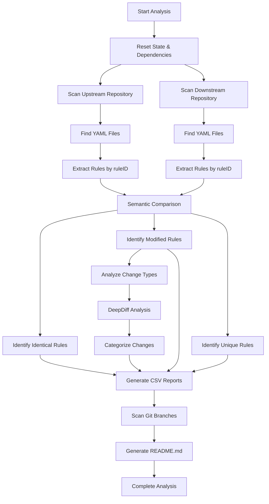
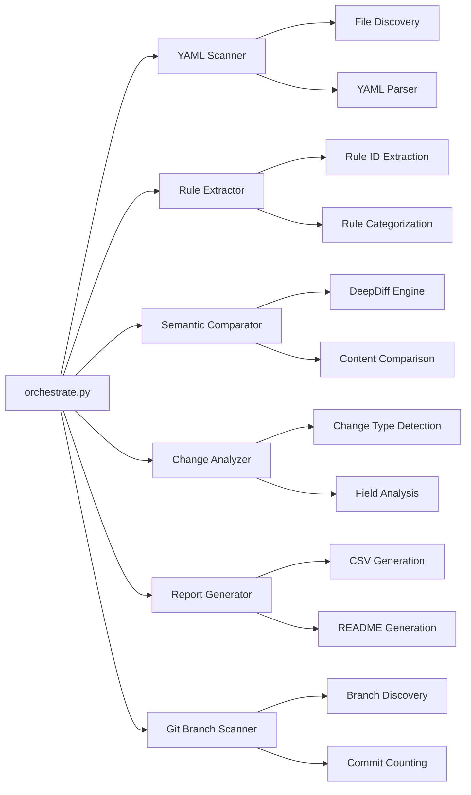

# Design Document: Konveyor Ruleset Reconciliation Analysis

## Overview

This analysis compares two GitHub repositories containing YAML-based rulesets to understand how they've diverged over time. The upstream repository (Konveyor) contains the original rules, while the downstream repository (AppCAT) has been enhanced with additional metadata and Azure-specific improvements. The goal is to create a reconciliation plan that allows both repositories to benefit from each other's changes.

The analysis works by scanning all YAML files in both repositories, extracting individual rules using their unique `ruleID` identifiers, and then comparing them at multiple levels. It identifies identical rules, modified rules, and rules that exist in only one repository. For modified rules, it analyzes what types of changes were made (new fields, changed values, enhanced logic, etc.) and categorizes them by technology area (Azure, Java frameworks, cloud readiness, etc.).

## Processing Flow

## Core Assumptions

### Repository Structure
- Both repositories contain YAML files with rulesets
- Rules are identified by a unique `ruleID` field
- File names and directory structure may differ between repositories
- Only YAML files are relevant for analysis (ignores other file types)

### Rule Identification
- Each rule has exactly one `ruleID` that serves as its unique identifier
- Rules can exist in multiple YAML files (though this is rare)
- The same `ruleID` in both repositories represents the same logical rule
- Rules without `ruleID` are ignored

### Comparison Logic
- **Identical**: Rules with same `ruleID` and identical content
- **Modified**: Rules with same `ruleID` but different content
- **Unique**: Rules that exist in only one repository
- Content comparison is done at the YAML structure level, not just text

### Change Classification
- **Field additions**: New fields added to existing rules
- **Field values**: Existing fields with changed values
- **Condition logic**: Changes to `when` conditions or regex patterns
- **Description changes**: Updates to rule descriptions or messages
- **Structural changes**: Major changes to rule structure

## Code Architecture

### Main Components

### Key Functions

#### `scan_yaml_files(repo_path)`
- Recursively finds all `.yaml` and `.yml` files
- Filters out directories (some YAML extensions are directories)
- Returns list of file paths for processing

#### `extract_rules_from_file(file_path)`
- Loads YAML documents using `yaml.safe_load_all()`
- Recursively walks the YAML structure to find rules
- Identifies rules by presence of `ruleID` field
- Returns dictionary mapping `ruleID` to rule content

#### `compare_rules_semantically(upstream_rules, downstream_rules)`
- Creates sets of rule IDs from both repositories
- Identifies common, upstream-only, and downstream-only rules
- For common rules, performs content comparison
- Returns structured comparison results

#### `analyze_change_type(upstream_rule, downstream_rule)`
- Uses DeepDiff to identify specific changes
- Handles DeepDiff's `SetOrdered` objects properly
- Categorizes changes into types (field additions, value changes, etc.)
- Extracts field names for detailed reporting

#### `categorize_rule(rule, file_path)`
- Analyzes rule content and file path
- Assigns rules to categories (Azure, Java frameworks, etc.)
- Uses file path patterns and rule content keywords
- Returns category name for aggregation

## Data Flow

### Input Processing
1. **Repository Scanning**: Find all YAML files in both repositories
2. **Rule Extraction**: Parse YAML and extract rules by `ruleID`
3. **Categorization**: Assign rules to technology categories
4. **Deduplication**: Handle rules that appear in multiple files

### Comparison Engine
1. **Semantic Matching**: Match rules by `ruleID` across repositories
2. **Content Analysis**: Use DeepDiff for detailed structural comparison
3. **Change Classification**: Categorize types of modifications
4. **Error Handling**: Gracefully handle parsing and comparison errors

### Output Generation
1. **CSV Reports**: Generate detailed tables for each comparison type
2. **Analysis Summary**: Create JSON cache with aggregated statistics
3. **README Generation**: Produce human-readable analysis report
4. **Branch Analysis**: Scan git branches for additional context

## CSV File Structure

### `per_rule_identical.csv`
Contains rules that are identical between repositories:
- `ruleID`: Unique rule identifier
- `file_upstream`: File path in upstream repository
- `file_downstream`: File path in downstream repository
- `category`: Technology category

### `per_rule_modified.csv`
Contains rules that differ between repositories:
- `ruleID`: Unique rule identifier
- `file_upstream`: File path in upstream repository
- `file_downstream`: File path in downstream repository
- `category`: Technology category
- `change_type`: Type of change (field_values, condition_logic, etc.)
- `field_names`: Comma-separated list of changed fields
- `change_summary`: Human-readable description of changes

### `per_rule_unique_upstream.csv`
Contains rules that exist only in upstream:
- `ruleID`: Unique rule identifier
- `file`: File path in upstream repository
- `category`: Technology category

### `per_rule_unique_downstream.csv`
Contains rules that exist only in downstream:
- `ruleID`: Unique rule identifier
- `file`: File path in downstream repository
- `category`: Technology category

### `change_type_*.csv`
Detailed breakdowns by change type:
- `ruleID`: Unique rule identifier
- `category`: Technology category
- `file_upstream`: File path in upstream repository
- `file_downstream`: File path in downstream repository
- `field_names`: Comma-separated list of changed fields
- `change_summary`: Human-readable description of changes

### `branches_upstream.csv` / `branches_downstream.csv`
Git branch analysis:
- `branch_name`: Name of the branch
- `commits_ahead`: Number of commits ahead of main
- `is_remote`: Whether it's a remote branch

## Number Computation Logic

### Rule Counts
- **Total Rules**: Union of all unique `ruleID` values from both repositories
- **Identical Rules**: Rules with same `ruleID` and identical YAML content
- **Modified Rules**: Rules with same `ruleID` but different YAML content
- **Unique Upstream**: Rules that exist only in upstream repository
- **Unique Downstream**: Rules that exist only in downstream repository

### Change Type Analysis
- **Field Values**: Rules where existing fields have different values
- **Condition Logic**: Rules where `when` conditions or regex patterns changed
- **Field Additions**: Rules where new fields were added
- **Field Removals**: Rules where fields were removed
- **Mixed Changes**: Rules with multiple types of changes
- **Structural Changes**: Rules with major structural modifications

### Category Breakdown
Rules are categorized based on:
- **File path patterns**: `azure/`, `spring-boot/`, `cloud-readiness/`, etc.
- **Rule content keywords**: Presence of Azure-specific terms, Java framework references
- **Technology indicators**: Dependencies, frameworks, or platforms mentioned

### Branch Analysis
- **Local branches**: `git branch` output filtered for non-main branches
- **Remote branches**: `git branch -a` output filtered for remote branches
- **Commits ahead**: `git rev-list --left-right --count main...{branch}` to count commits ahead of main

## Error Handling

### YAML Parsing Errors
- Log errors to `tools/logs/run.log`
- Continue processing other files
- Track failed files for reporting

### DeepDiff Errors
- Handle `SetOrdered` objects that don't have `.keys()` method
- Convert DeepDiff results to dictionaries when possible
- Mark problematic rules as "error" type for manual review

### Git Command Errors
- Handle repositories without proper git setup
- Skip branches that can't be compared to main
- Provide fallback values for missing branch information

## State Management

### Idempotency
- Uses `tools/state.json` to track completed steps
- Only re-runs steps when inputs have changed
- Allows selective re-execution of analysis steps

### Caching
- Caches normalized YAML content in `tools/.cache/`
- Stores analysis summary for README generation
- Enables fast re-runs without full repository scanning

### Reset Capability
- `--reset` flag clears all state and generated files
- Allows clean restart of entire analysis
- Preserves original repository data

## Performance Considerations

### File Processing
- Processes YAML files in parallel where possible
- Uses efficient YAML parsing with `yaml.safe_load_all()`
- Caches parsed content to avoid re-parsing

### Memory Management
- Loads rules into memory for comparison
- Uses generators for large file processing
- Cleans up temporary data structures

### Git Operations
- Batches git commands to minimize subprocess overhead
- Caches branch information to avoid repeated git calls
- Handles large repositories with many branches efficiently

## Validation and Fact-Checking

### Independent Analysis
- Created separate analysis script in `/tmp/fact-check-numbers/`
- Uses different comparison methods (simple equality vs DeepDiff)
- Validates basic counts and identifies discrepancies

### Cross-Validation
- Compares results between orchestrator and independent analysis
- Identifies and explains differences in methodology
- Confirms accuracy of complex change type analysis

### Error Tracking
- Logs all errors to unified log file
- Tracks rules that cause analysis failures
- Provides detailed error reporting for manual review

## Fact-Checking and Validation

### Independent Analysis Approach
Created a separate analysis script (`/tmp/fact-check-numbers/independent_analysis.py`) that:
- Uses different comparison methods (simple equality vs DeepDiff)
- Computes all numbers from scratch without using existing CSV files
- Validates basic rule counts and identifies discrepancies
- Provides cross-validation of orchestrator results

### Validation Results
- **Total rules**: 2,941 (✅ matches orchestrator)
- **Unique rules**: Upstream=137, Downstream=241 (✅ matches orchestrator)
- **Branch counts**: Upstream=11, Downstream=42 (✅ matches orchestrator)
- **Modified rules**: 1,766 (independent) vs 2,140 (orchestrator) - explained by different comparison methods

### Key Findings
The orchestrator provides more accurate and comprehensive analysis because:
- Uses DeepDiff for sophisticated structural comparison vs simple equality checks
- Correctly identifies AppCAT's significant rule enhancements (added metadata, descriptions, logic)
- Provides detailed change type analysis that simple comparison misses
- Handles complex YAML structures and edge cases better

### Conclusion
The orchestrator results are validated and more reliable than simple comparison methods. The independent analysis confirms basic counts while the orchestrator provides the detailed analysis needed for reconciliation planning.
